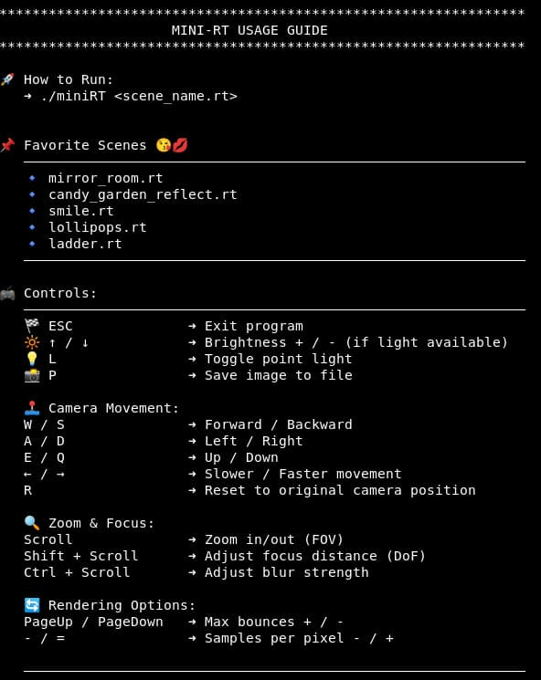

# ⚡ MiniRayTracer: 42-miniRT

## 🌀 Overview

A lightweight ray tracer written in C. Its purpose is to introduce the fundamentals of ray tracing math, vectors, intersections, and the basic of lightings.
It loads a .rt scene, computes rays for each pixel, intersects them with objects, applies lighting, and renders the final image using MLX42.

---
## ✨ Features

### 🧱 Material System
Each object includes a flexible material configuration:
- Smoothness: controls how “sharp” or “soft” the reflection looks (mirror: complete smoothness >< chalk: complete roughness)
- Specular probability: probability factor for specular reflection contribution
- Emitter: makes an object emit its own light (glowing surfaces, neon objects)
- Specular color: RGB tint for specular highlights
- Checker pattern: enables procedural checkerboard patterns on any object

### 🎥 Camera
- Position and normalized orientation vector
- Horizontal FOV between 0° and 180°
- Full scene rendering from the camera’s viewpoint
- Supports translation and rotation

### 💡 Lighting
- Ambient light — base illumination, no object is fully black
- Multiple point lights
- Colored lights
- Diffuse shading
- Hard shadows by ray–object occlusion (shadow appears when an object blocks the light ray. The edge is sharp instead of performing soft-shadow math.

### 🔷 Geometry & Objects
#### All objects support:
- Ray intersection
- Surface normal computation
- Lighting response (ambient + diffuse + specular if enabled)
- Transformations: translation & rotation (Except sphere & lights: they can translate but not rotate.)

#### Supported object types:
- Sphere: center, diameter, material, color
- Plane: point on plane, normal, material, color
- Cylinder: center, axis vector, diameter, height, material, color

## 🏗 Build & Run
### 📦 Requirements
Before building, you must have:
- MLX42 installed (with glfw)
- C compiler (gcc or clang)
- Make
flags: -lm for math library; -ldl -lglfw -pthread (MLX42 dependencies)

### 📸 Preview
scenes/lollipops.rt


random_scenes/mirror_room_aes_rt


### 🔨 Build
From the project root, do:
```
make
```
#### ▶️ Run

Run an .rt scene. At root, scenes can be found in the folder.
```
./miniRT scenes/lollipops.rt
```
#### 🕹️ How to Play


#### 🧹 Clean and rebuild
```
make clean   #Remove object files
make fclean  #Remove everything including binary
make re      #Rebuild from scratch
```
## ✨ Contributors
- @Omppu0    - Luka Taalas
- @novth17   - Lily Hien Nguyen
  
Huge thanks to my passionate partner, Luka, who loves exploring physics, had fun with [Raytracing Book]([url](https://raytracing.github.io/books/RayTracingInOneWeekend.html)), and always ready to “what if we add one more bonus?”.
